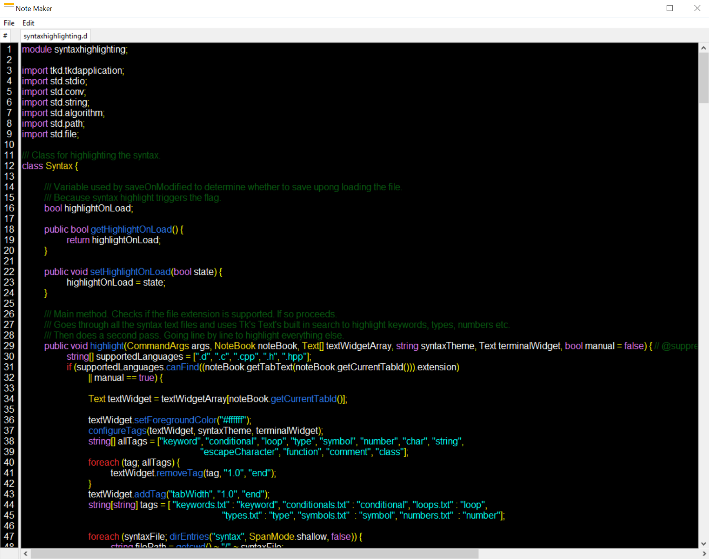
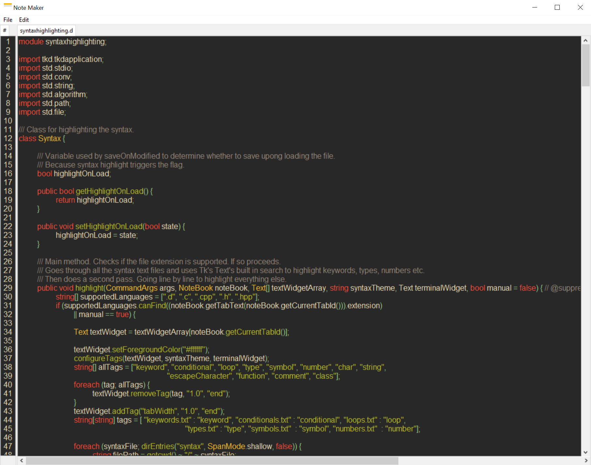

# NoteMaker-D

What started as an application for making notes, over time became a pretty decent code editor.

## Features

- Cross platform. On paper, in practice it should be but it hasn't been tested on MacOS.

- Adding matching pairs for the following symbols: ( { [ < " ` ' at the insert cursor or around selection.

- Syntax highlighting for languages with C like syntax. Officially supported files types:
  - .d
  - .c
  - .cpp
  - .h
  - .hpp
  - You can also highlight the current file manually using Control-L. Results will vary depending on the language and the coding style.

- Multiple files open at once in different tabs.

- Reopen closed tabs in the order they were closed.

- Line numbers display the currently visible lines.

- A very basic terminal implementation.
  - Pass a single command and gets its output.
  - NOTE: You can issue multiple commands by chaining them together.

- Preferences window with options for changing the font, fg, bg, save on modified toggle, opacity slide, terminal shell and syntax theme.

- Indent and unindent the entire selection by using Tab and Shift-Tab respectively.
  - Unless you're on Linux where the binding doesn't work but you can use the edit menu instead.

- You can change tabs using Control-Tab and Control-Shift-Tab these are default on Windows.
  - Alternatively Control-1 and Control-2 use my method which automatically focuses the text widget within so you can start typing.

- The default option for terminal uses cmd.exe on Windows and /bin/sh on Linux.
  - To use a different shell replace default with the path to the binary.

- There are two themes built in. My own one and Gruvbox.

## How To Build

In order to build this program you will need my own fork of Tkd. Found [here](https://github.com/AndrewGrim/tkd).

Once you download it you will need to provide the path to the directoy where the `dub.json` file is.

Use this terminal command to add the fork as a local package to dub:

    dub add-local <pathToDirWithDubFile>

Navigate to the NoteMaker directory and in the terminal use:

    make release 

or

    dub --build=release

